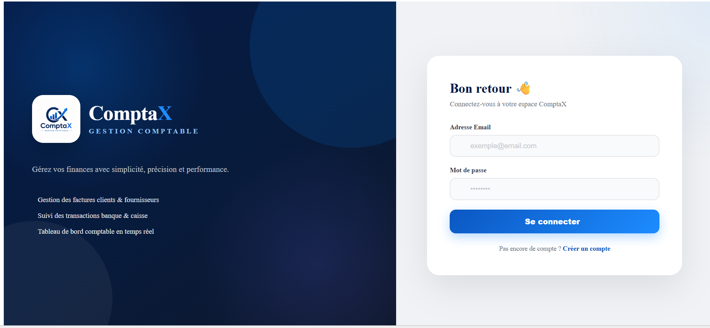
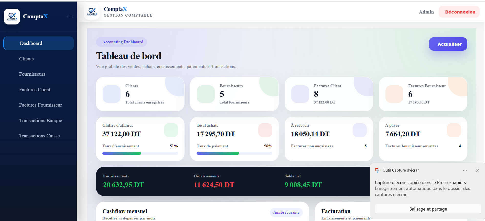
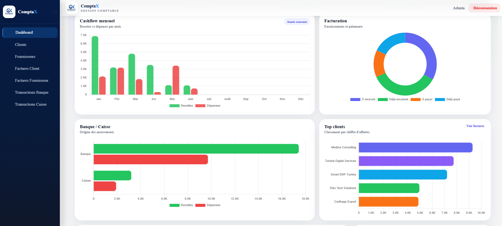
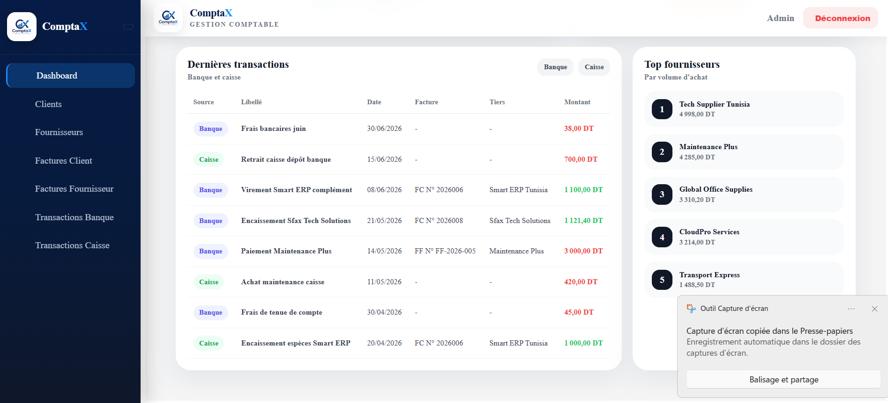
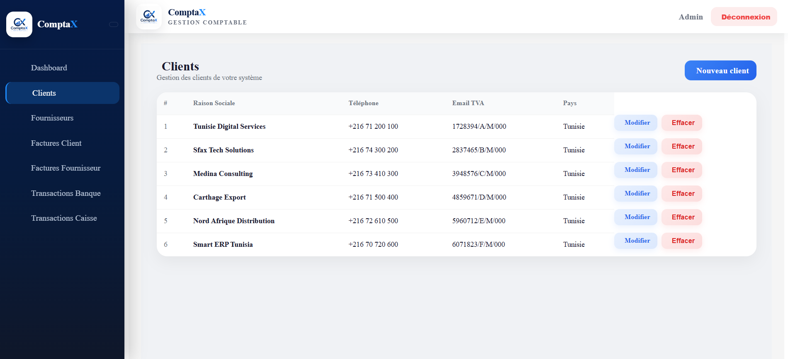
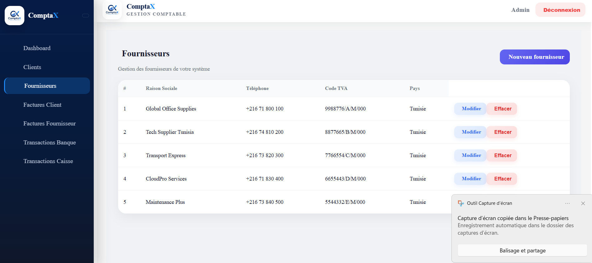
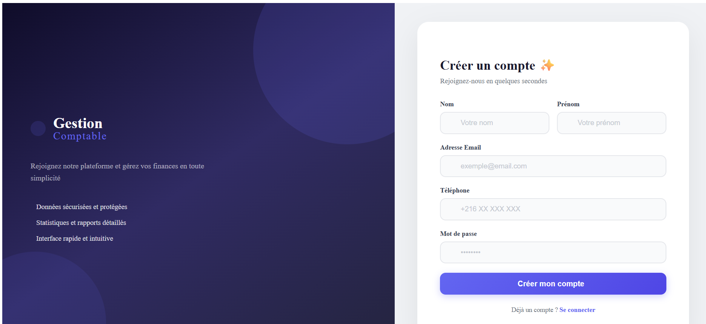

# Accounting Management System

## 📌 Description

A web application developed to manage accounting operations for businesses.

The application allows users to manage clients, suppliers, invoices, bank transactions and cash transactions through a centralized platform.

## 🛠️ Technologies

- Java
- Spring Boot
- Angular
- MySQL
- Hibernate / JPA
- JWT Authentication
- JasperReports
- Git

## ✨ Main Features

- User authentication
- Client management
- Supplier management
- Customer invoice management
- Supplier invoice management
- Bank transaction management
- Cash transaction management
- Dashboard with statistics
- PDF invoice generation

## 🏗️ Architecture

The application uses a backend/frontend architecture:

- **Backend:** Spring Boot REST API
- **Frontend:** Angular
- **Database:** MySQL

## 👨‍💻 My Contribution

Designed and developed the application as part of my Business Information Systems studies, including backend development, frontend development, database integration and authentication.

## 📷 Screenshots

### Login

### Dashboard

### Client Management

### Suplier Management

### Register  

